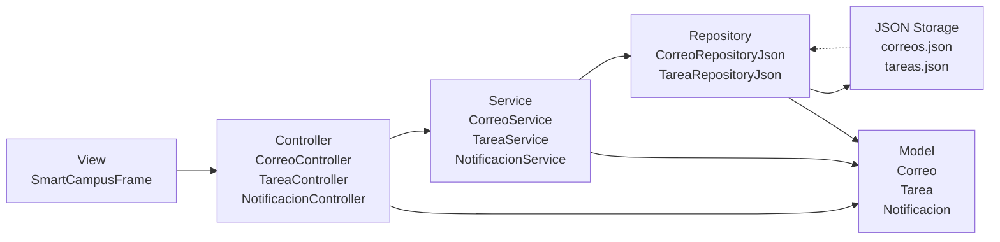
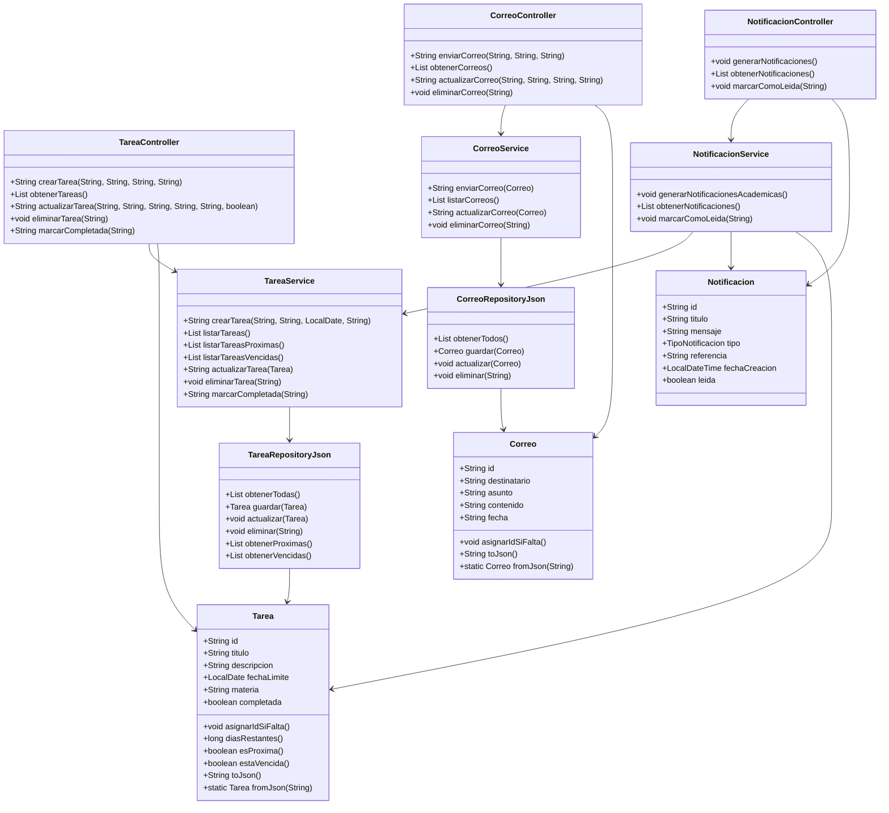

# SmartCampus-Notify

Sistema académico emulado de notificaciones y correos con arquitectura **MVC** y persistencia **JSON**.

## UML del proyecto

El siguiente diagrama muestra la arquitectura principal del proyecto:



## Diagrama de clases



## Secciones principales

- `src/model`: entidades `Correo`, `Tarea`, `Notificacion`
- `src/controller`: controladores de entrada para la UI
- `src/service`: lógica de negocio y validaciones
- `src/repository`: persistencia en JSON
- `src/util`: utilidades de parseo JSON
- `src/view`: interfaz Swing completa
- `src/exception`: excepciones personalizadas

## Ejecución

```bash
cd /home/poveita/Documents/desarrollo/Desarrollo_De_Clase/SmartCampus-Notify/SmartCampus-Notify
mkdir -p bin
find src -name '*.java' | grep -v 'src/test' | xargs javac -d bin
java -cp bin App
```
