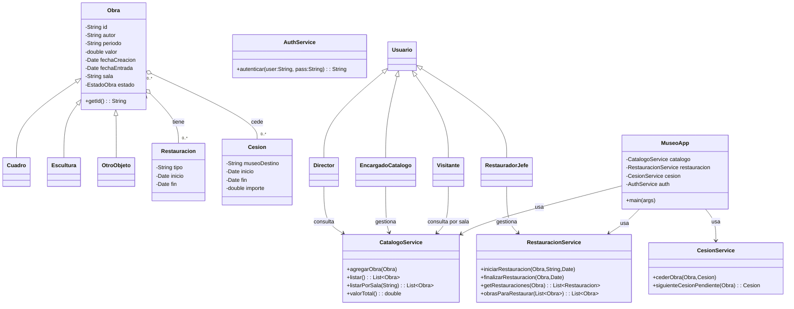

# Sistema Museo - 

```mermaid
classDiagram
    class Obra {
      -String id
      -String autor
      -String periodo
      -double valor
      -Date fechaCreacion
      -Date fechaEntrada
      -String sala
      -EstadoObra estado
      +getId(): String
    }
    class Cuadro
    class Escultura
    class OtroObjeto
    Obra <|-- Cuadro
    Obra <|-- Escultura
    Obra <|-- OtroObjeto

    class Restauracion {
      -String tipo
      -Date inicio
      -Date fin
    }
    Obra "1" o-- "0..*" Restauracion : tiene

    class Cesion {
      -String museoDestino
      -Date inicio
      -Date fin
      -double importe
    }
    Obra "0..*" o-- "0..*" Cesion : cede

    class CatalogoService {
      +agregarObra(Obra)
      +listar(): List~Obra~
      +listarPorSala(String): List~Obra~
      +valorTotal(): double
    }
    class RestauracionService {
      +iniciarRestauracion(Obra,String,Date)
      +finalizarRestauracion(Obra,Date)
      +getRestauraciones(Obra): List~Restauracion~
      +obrasParaRestaurar(List~Obra~): List~Obra~
    }
    class CesionService {
      +cederObra(Obra,Cesion)
      +siguienteCesionPendiente(Obra): Cesion
    }
    class AuthService {
      +autenticar(user:String, pass:String): String
    }

    class Usuario
    class EncargadoCatalogo
    class RestauradorJefe
    class Director
    class Visitante
    Usuario <|-- EncargadoCatalogo
    Usuario <|-- RestauradorJefe
    Usuario <|-- Director
    Usuario <|-- Visitante

    Director --> CatalogoService : consulta
    EncargadoCatalogo --> CatalogoService : gestiona
    RestauradorJefe --> RestauracionService : gestiona
    Visitante --> CatalogoService : consulta por sala

    %% GUI panels implemented
    class MuseoApp {
      +main(args)
      -CatalogoService catalogo
      -RestauracionService restauracion
      -CesionService cesion
      -AuthService auth
    }
    MuseoApp --> CatalogoService : usa
    MuseoApp --> RestauracionService : usa
    MuseoApp --> CesionService : usa

```